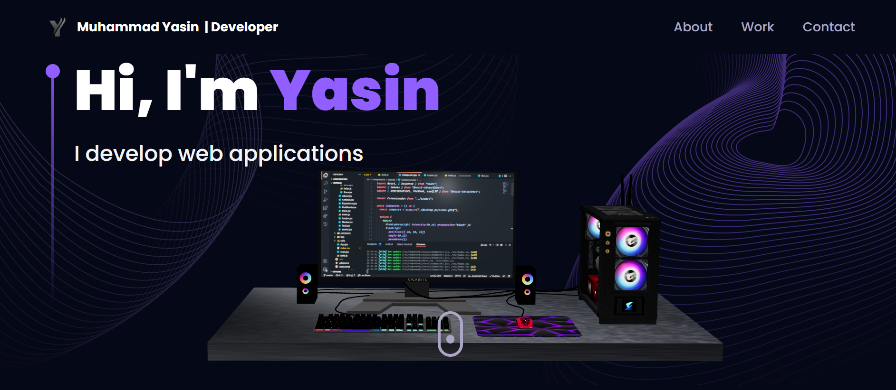

# Portfolio Project

Portfolio Project is build using Vitejs, 3D models, Threejs,@emailjs/browser.
## Live website

[Portfolio](https://muhammadyasin.vercel.app/)

## Project Info
- This project is build using Vitejs and Threejs.
- React-parallax-tilt is used for tilting components.
- React router dom is used for routing.

## Installation

Use the following command to download related dependencies

```bash
npm install --legacy-peer-deps @react-three/fiber @react-three/drei maath react-parallax-tilt react-vertical-timeline-component @emailjs/browser framer-motion react-router-dom three
```

## Preview




